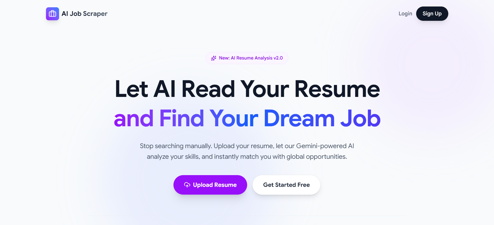
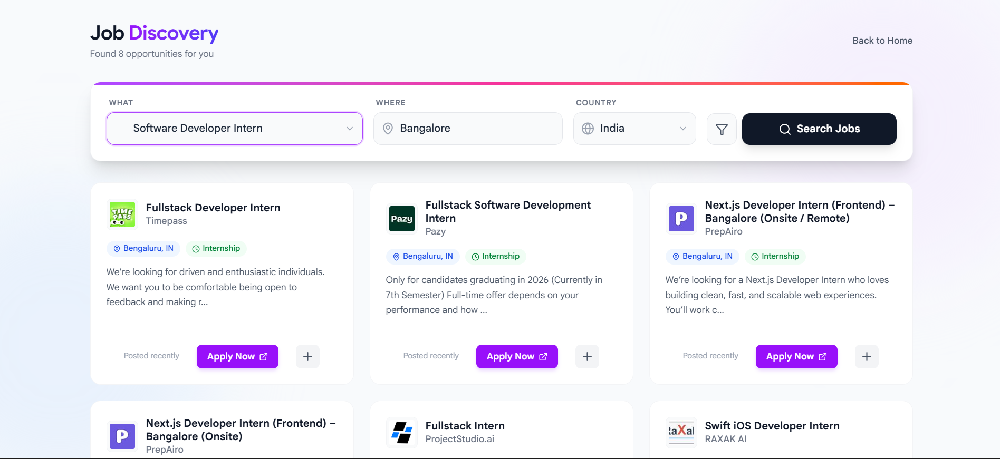
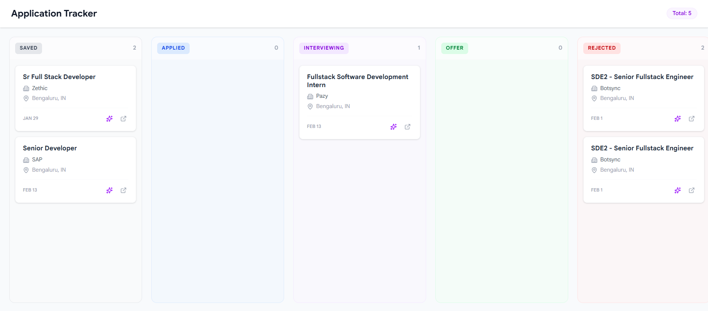
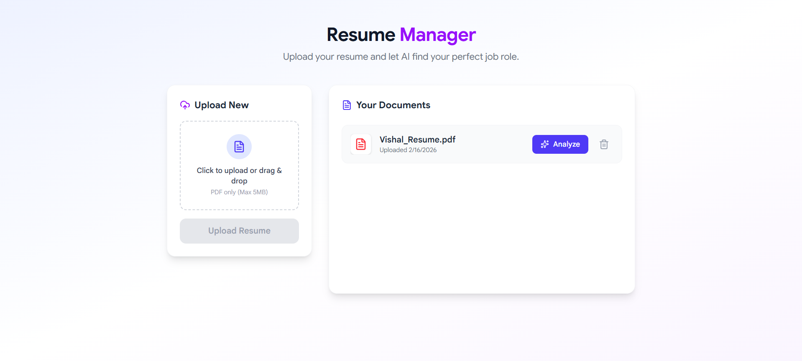
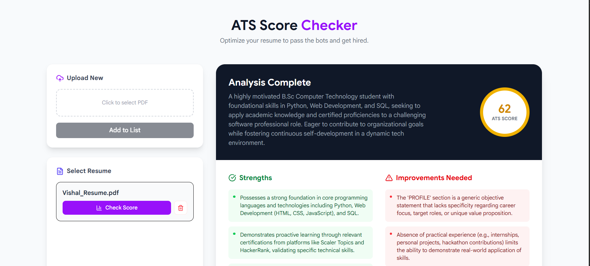

# 🚀 AI Job Scraper & Tracker

## 📌 Introduction
AI Job Scraper is a full-stack web application that simplifies the job search process by combining job aggregation, AI-powered resume analysis, and application tracking into a single platform.

Users can:
- Get AI-suggested job roles based on their resume
- View job listings from multiple platforms
- Analyze resume ATS score and improvements
- Track job applications using a Kanban board

---

## 🧠 Features

### 1. AI-Based Job Role Suggestion
- Upload resume
- Processed using Gemini API
- Extracts skills and experience
- Suggests top 5 relevant job roles
- User selects role + filters (location, experience, etc.)

---

### 2. Job Scraping & Aggregation
- Uses JSearch API
- Fetches jobs from multiple platforms
- Filters:
  - Role
  - Location
  - Experience
- Displays unified job listings

---

### 3. ATS Resume Analysis
- Upload resume
- Gemini API analyzes content
- Outputs:
  - ATS Score
  - Resume improvement suggestions

---

### 4. Job Tracker (Kanban Board)
- Track job applications visually
- Columns:
  - Pending
  - Interviewing
  - Rejected
  - Selected
- Helps manage application workflow

---

## 🛠️ Tech Stack

**Frontend**
- React.js
- Tailwind CSS

**Backend**
- Node.js
- Express.js

**Database**
- MongoDB

**APIs**
- Gemini API (AI processing)
- JSearch API (job scraping)

---

## ⚙️ How It Works

1. User uploads resume  
2. Resume is processed by Gemini API  
3. AI suggests job roles  
4. User selects role + filters  
5. JSearch API fetches jobs  
6. Jobs displayed in UI  
7. User tracks applications in Kanban board  
8. Optional ATS analysis for resume  

---

## 📸 Screenshots
  <p align="center">
  
  
  
  
  
</p>


---

## 🚀 Setup & Installation

### 1. Clone Repository
```bash
git clone https://github.com/your-username/ai-job-scraper.git
cd ai-job-scraper


Frontend

cd client
npm install
npm start


Backend

cd server
npm install
npm run dev

Environment Variables

MONGO_URI=your_mongodb_connection
GEMINI_API_KEY=your_gemini_api_key
JSEARCH_API_KEY=your_jsearch_api_key
